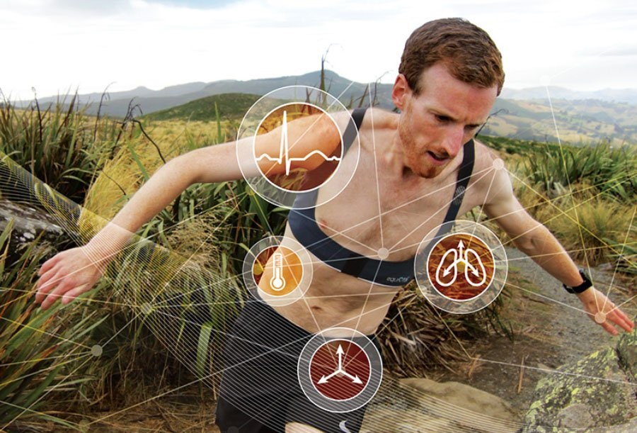

```{r setup, include = FALSE}
# general options --------------------------------------------------------------
options(scipen = 999)
set.seed(123)
# chunk options ----------------------------------------------------------------
knitr::opts_chunk$set(
  cache.extra = knitr::rand_seed, 
  message = FALSE, 
  warning = FALSE, 
  error = FALSE, 
  echo = FALSE,
  cache = FALSE,
  comment = "", 
  fig.align = "center", 
  fig.retina = 3
  )
# libraries --------------------------------------------------------------------
library(magrittr)
library(tidyverse)
library(knitr)
library(scales)
library(nomnoml)
library(flipbookr)
library(tidytext)
library(here)
library(janitor)
library(papaja)
library(mgcv)
library(tweetrmd)
library(gratia)
library(htmltools)
library(plotly)

# theme ------------------------------------------------------------------------
# library(xaringanthemer)
# style_xaringan(code_font_google = google_font("IBM Plex Mono"))
# style_duo(primary_color = "#1F4257", secondary_color = "#F97B64")
```

layout: true
  
<div class="custom-footer"><span>CX Emotion - Disenchantment with Emotion Recognition Technologies - Dupré (2020) </span></div>

---

# Current Methods

Possible measurements include:

* Heart Rate and Heart Rate Variability (with ECG, PPG, ...)
* Breathing Rate (with mechanical belt, thermal camera, wifi, ...)
* Skin Temperature (with wearable thermometer, thermal/infrared camera, laser, ...)
* Sudation (with EDA also called GSR)

--

![:col_header Wired Sensors, Wearable Sensors, Remote Sensors]
![:col_row 
```{r out.width = "100%"}

```
<a href="https://doi.org/10.1109/T-AFFC.2011.15"> Credit: Koelstra et al. (2011) `r emo::ji("link")`</a>
,
```{r out.width = "100%"}

```
<a href="https://www.adinstruments.com/partners/equivital"> Credit: ADinstruments & Equivital `r emo::ji("link")`</a>
,
```{r out.width = "100%"}
knitr::include_graphics("media/sensors_remote.png")
```
<a href="https://www.cu-bx.com/"> Credit: ContinUse Biometrics `r emo::ji("link")`</a>
]

